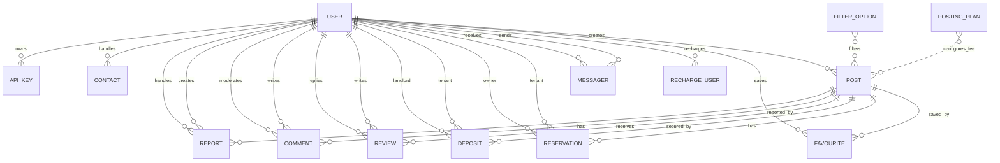

# CDM Project PhongTro

Tài liệu này mô tả Conceptual Data Model (CDM) cho hệ thống quản lý phòng trọ, dựa trên các model MongoDB trong `server/src/models`. Cách trình bày bám theo tư duy PowerDesigner: Entity, Identifier, Attribute, Relationship và Cardinality.

## 1. Ký hiệu

| Ký hiệu | Ý nghĩa |
| --- | --- |
| `PK` | Identifier chính của entity |
| `FK` | Thuộc tính tham chiếu entity khác |
| `0,n` | Có thể không có hoặc có nhiều |
| `1,n` | Có ít nhất một hoặc nhiều |
| `0,1` | Có thể không có hoặc có một |
| `1,1` | Bắt buộc đúng một |

## 2. Danh sách Entity

### 2.1 USER

Người dùng hệ thống, gồm người thuê, chủ trọ và admin.

| Attribute | Type | Constraint | Ghi chú |
| --- | --- | --- | --- |
| `_id` | ObjectId | PK | Mã người dùng |
| `fullName` | String | Required | Họ tên |
| `email` | String | Required | Email đăng nhập |
| `password` | String | Required | Mật khẩu hash |
| `address` | String | Required | Địa chỉ |
| `avatar` | String | Required | Ảnh đại diện |
| `phone` | String | Required | Số điện thoại |
| `isAdmin` | Boolean | Default `false` | Quyền admin |
| `isActive` | Boolean | Default `true` | Trạng thái tài khoản |
| `balance` | Number | Default `0` | Số dư ví |
| `typeLogin` | String | `email`, `google` | Loại đăng nhập |
| `createdAt` | Date | Auto | Ngày tạo |
| `updatedAt` | Date | Auto | Ngày cập nhật |

### 2.2 POST

Bài đăng phòng trọ.

| Attribute | Type | Constraint | Ghi chú |
| --- | --- | --- | --- |
| `_id` | ObjectId | PK | Mã bài đăng |
| `title` | String | Required | Tiêu đề |
| `price` | Number | Required | Giá thuê/tháng |
| `description` | String | Required | Mô tả |
| `images` | Array | Required | Danh sách ảnh |
| `userId` | ObjectId | FK USER | Người đăng/chủ trọ |
| `category` | String | Enum | `phong-tro`, `nha-nguyen-can`, `can-ho-chung-cu`, `can-ho-mini` |
| `location` | String | Required | Địa chỉ phòng |
| `phone` | String | Required | SĐT liên hệ |
| `username` | String | Required | Tên người đăng |
| `area` | Number | Required | Diện tích |
| `options` | Mixed | Required | Tiện nghi |
| `status` | String | Enum | `active`, `inactive`, `rejected` |
| `availabilityStatus` | String | Enum | `available`, `unavailable`, `reserved`, `rented` |
| `typeNews` | String | Enum | `vip`, `normal` |
| `postingFee` | Number | Default `0` | Phí đăng tin đã thu |
| `endDate` | Date | Required | Ngày hết hạn tin |
| `ratingAverage` | Number | Default `0` | Điểm trung bình |
| `ratingCount` | Number | Default `0` | Số lượt đánh giá |
| `createdAt` | Date | Auto | Ngày tạo |
| `updatedAt` | Date | Auto | Ngày cập nhật |

### 2.3 POSTING_PLAN

Gói đăng tin do admin quản lý.

| Attribute | Type | Constraint | Ghi chú |
| --- | --- | --- | --- |
| `_id` | ObjectId | PK | Mã gói |
| `typeNews` | String | Unique pair, Enum | `vip`, `normal` |
| `name` | String | Required | Tên gói |
| `label` | String | Optional | Nhãn hiển thị |
| `description` | String | Optional | Mô tả |
| `durationDays` | Number | Unique pair, Required | Số ngày đăng |
| `price` | Number | Required | Giá gói |
| `benefits` | String[] | Optional | Quyền lợi |
| `isActive` | Boolean | Default `true` | Bật/tắt gói |
| `sortOrder` | Number | Default `0` | Thứ tự hiển thị |
| `createdAt` | Date | Auto | Ngày tạo |
| `updatedAt` | Date | Auto | Ngày cập nhật |

Identifier phụ: unique (`typeNews`, `durationDays`).

### 2.4 FAVOURITE

Tin đã lưu của người dùng.

| Attribute | Type | Constraint | Ghi chú |
| --- | --- | --- | --- |
| `_id` | ObjectId | PK | Mã lưu tin |
| `userId` | ObjectId | FK USER | Người lưu |
| `postId` | ObjectId | FK POST | Bài đăng được lưu |
| `createdAt` | Date | Auto | Ngày tạo |
| `updatedAt` | Date | Auto | Ngày cập nhật |

### 2.5 RECHARGE_USER

Giao dịch nạp tiền vào ví.

| Attribute | Type | Constraint | Ghi chú |
| --- | --- | --- | --- |
| `_id` | ObjectId | PK | Mã giao dịch |
| `userId` | ObjectId | FK USER | Người nạp |
| `amount` | Number | Required | Số tiền |
| `typePayment` | String | Required | Phương thức thanh toán |
| `status` | String | Required | Trạng thái giao dịch |
| `createdAt` | Date | Auto | Ngày tạo |
| `updatedAt` | Date | Auto | Ngày cập nhật |

### 2.6 MESSAGER

Tin nhắn giữa người dùng.

| Attribute | Type | Constraint | Ghi chú |
| --- | --- | --- | --- |
| `_id` | ObjectId | PK | Mã tin nhắn |
| `senderId` | ObjectId | FK USER | Người gửi |
| `receiverId` | ObjectId | FK USER | Người nhận |
| `message` | String | Required | Nội dung |
| `status` | String | Required | Trạng thái |
| `isRead` | Boolean | Default `false` | Đã đọc |
| `createdAt` | Date | Auto | Ngày tạo |
| `updatedAt` | Date | Auto | Ngày cập nhật |

### 2.7 RESERVATION

Yêu cầu giữ chỗ/xem phòng.

| Attribute | Type | Constraint | Ghi chú |
| --- | --- | --- | --- |
| `_id` | ObjectId | PK | Mã giữ chỗ |
| `postId` | ObjectId | FK POST | Phòng được giữ chỗ |
| `tenantId` | ObjectId | FK USER | Người thuê |
| `ownerId` | ObjectId | FK USER | Chủ trọ |
| `tenantName` | String | Required | Tên người thuê |
| `tenantPhone` | String | Optional | SĐT người thuê |
| `note` | String | Optional | Ghi chú người thuê |
| `visitDate` | Date | Optional | Ngày muốn xem phòng |
| `status` | String | Enum | `pending`, `accepted`, `rejected`, `cancelled`, `expired` |
| `ownerNote` | String | Optional | Ghi chú chủ trọ |
| `handledAt` | Date | Optional | Ngày xử lý |
| `expiresAt` | Date | Optional | Ngày hết hạn giữ chỗ |
| `createdAt` | Date | Auto | Ngày tạo |
| `updatedAt` | Date | Auto | Ngày cập nhật |

### 2.8 DEPOSIT

Giao dịch đặt cọc trung gian.

| Attribute | Type | Constraint | Ghi chú |
| --- | --- | --- | --- |
| `_id` | ObjectId | PK | Mã giao dịch cọc |
| `roomId` | ObjectId | FK POST | Phòng được đặt cọc |
| `tenantId` | ObjectId | FK USER | Người thuê |
| `landlordId` | ObjectId | FK USER | Chủ trọ |
| `amount` | Number | Required | Tiền cọc |
| `paymentMethod` | String | Enum | `SIMULATED`, `MOMO`, `VNPAY` |
| `paymentStatus` | String | Enum | `unpaid`, `paid`, `failed` |
| `status` | String | Enum | `pending`, `holding`, `completed`, `refunded`, `cancelled`, `disputed` |
| `tenantConfirm` | Boolean | Default `false` | Người thuê xác nhận |
| `landlordConfirm` | Boolean | Default `false` | Chủ trọ xác nhận |
| `balanceHeld` | Boolean | Default `false` | Tiền đang giữ trung gian |
| `expiredAt` | Date | Required | Hạn xử lý |
| `adminNote` | String | Optional | Ghi chú admin |
| `createdAt` | Date | Auto | Ngày tạo |
| `updatedAt` | Date | Auto | Ngày cập nhật |

Identifier phụ: mỗi phòng chỉ có một giao dịch cọc đang hoạt động (`pending`, `holding`, `disputed`).

### 2.9 REVIEW

Đánh giá phòng sau giao dịch hợp lệ.

| Attribute | Type | Constraint | Ghi chú |
| --- | --- | --- | --- |
| `_id` | ObjectId | PK | Mã đánh giá |
| `roomId` | ObjectId | FK POST | Phòng được đánh giá |
| `userId` | ObjectId | FK USER | Người đánh giá |
| `rentalId` | ObjectId | Required | Mã giao dịch liên quan |
| `rentalType` | String | Enum | `reservation`, `deposit`, `rental`, `booking`, `contract` |
| `rating` | Number | 1..5 | Điểm tổng |
| `cleanlinessRating` | Number | 1..5 | Vệ sinh |
| `securityRating` | Number | 1..5 | An ninh |
| `locationRating` | Number | 1..5 | Vị trí |
| `priceRating` | Number | 1..5 | Giá |
| `content` | String | Required | Nội dung |
| `images` | String[] | Optional | Ảnh đánh giá |
| `reply.content` | String | Optional | Phản hồi chủ trọ |
| `reply.ownerId` | ObjectId | FK USER | Chủ trọ phản hồi |
| `reply.createdAt` | Date | Optional | Ngày phản hồi |
| `status` | String | Enum | `visible`, `hidden`, `reported`, `deleted` |
| `reports[]` | Embedded | Optional | Báo cáo đánh giá |
| `reportCount` | Number | Default `0` | Số lượt báo cáo |
| `createdAt` | Date | Auto | Ngày tạo |
| `updatedAt` | Date | Auto | Ngày cập nhật |

Identifier phụ: unique (`userId`, `rentalId`).

### 2.10 COMMENT

Bình luận trên bài đăng.

| Attribute | Type | Constraint | Ghi chú |
| --- | --- | --- | --- |
| `_id` | ObjectId | PK | Mã bình luận |
| `postId` | ObjectId | FK POST | Bài đăng |
| `userId` | ObjectId | FK USER | Người bình luận |
| `content` | String | Required | Nội dung |
| `status` | String | Enum | `visible`, `hidden`, `deleted` |
| `moderationNote` | String | Optional | Ghi chú kiểm duyệt |
| `moderatedBy` | ObjectId | FK USER | Admin kiểm duyệt |
| `moderatedAt` | Date | Optional | Ngày kiểm duyệt |
| `createdAt` | Date | Auto | Ngày tạo |
| `updatedAt` | Date | Auto | Ngày cập nhật |

### 2.11 REPORT

Báo cáo bài đăng.

| Attribute | Type | Constraint | Ghi chú |
| --- | --- | --- | --- |
| `_id` | ObjectId | PK | Mã báo cáo |
| `postId` | ObjectId | FK POST | Bài bị báo cáo |
| `reporterId` | ObjectId | FK USER | Người báo cáo |
| `reporterName` | String | Required | Tên người báo cáo |
| `reporterEmail` | String | Required | Email người báo cáo |
| `reason` | String | Required | Lý do |
| `details` | String | Optional | Chi tiết |
| `status` | String | Enum | `pending`, `resolved`, `rejected` |
| `handledBy` | ObjectId | FK USER | Admin xử lý |
| `note` | String | Optional | Ghi chú xử lý |
| `actionTaken` | String | Enum | `none`, `hide_post`, `takedown_post` |
| `actionAt` | Date | Optional | Ngày xử lý |
| `postStatusBefore` | String | Optional | Trạng thái bài trước xử lý |
| `postStatusAfter` | String | Optional | Trạng thái bài sau xử lý |
| `createdAt` | Date | Auto | Ngày tạo |
| `updatedAt` | Date | Auto | Ngày cập nhật |

### 2.12 CONTACT

Liên hệ/góp ý từ người dùng hoặc khách.

| Attribute | Type | Constraint | Ghi chú |
| --- | --- | --- | --- |
| `_id` | ObjectId | PK | Mã liên hệ |
| `name` | String | Required | Họ tên |
| `email` | String | Required | Email |
| `phone` | String | Optional | SĐT |
| `message` | String | Required | Nội dung |
| `status` | String | Enum | `pending`, `resolved`, `rejected` |
| `adminNote` | String | Optional | Ghi chú admin |
| `handledBy` | ObjectId | FK USER | Admin xử lý |
| `handledAt` | Date | Optional | Ngày xử lý |
| `createdAt` | Date | Auto | Ngày tạo |
| `updatedAt` | Date | Auto | Ngày cập nhật |

### 2.13 FILTER_OPTION

Cấu hình bộ lọc tìm kiếm.

| Attribute | Type | Constraint | Ghi chú |
| --- | --- | --- | --- |
| `_id` | ObjectId | PK | Mã bộ lọc |
| `field` | String | Unique pair, Enum | `category`, `priceRange`, `areaRange`, `typeNews` |
| `value` | String | Unique pair | Giá trị lọc |
| `label` | String | Required | Nhãn hiển thị |
| `description` | String | Optional | Mô tả |
| `minValue` | Number | Optional | Giá trị nhỏ nhất |
| `maxValue` | Number | Optional | Giá trị lớn nhất |
| `sortOrder` | Number | Default `0` | Thứ tự |
| `isActive` | Boolean | Default `true` | Bật/tắt |
| `createdAt` | Date | Auto | Ngày tạo |
| `updatedAt` | Date | Auto | Ngày cập nhật |

Identifier phụ: unique (`field`, `value`).

### 2.14 KEYWORD_SEARCH

Từ khóa tìm kiếm phổ biến.

| Attribute | Type | Constraint | Ghi chú |
| --- | --- | --- | --- |
| `_id` | ObjectId | PK | Mã từ khóa |
| `title` | String | Required | Từ khóa |
| `count` | Number | Default `0` | Số lượt |
| `createdAt` | Date | Auto | Ngày tạo |
| `updatedAt` | Date | Auto | Ngày cập nhật |

### 2.15 OTP

Mã OTP xác thực/quên mật khẩu.

| Attribute | Type | Constraint | Ghi chú |
| --- | --- | --- | --- |
| `_id` | ObjectId | PK | Mã OTP |
| `email` | String | Required | Email nhận OTP |
| `otp` | String | Required | Mã OTP |
| `time` | Date | TTL 300s | Thời điểm tạo |
| `type` | String | Enum | `forgotPassword`, `verifyAccount` |
| `createdAt` | Date | Auto | Ngày tạo |
| `updatedAt` | Date | Auto | Ngày cập nhật |

### 2.16 API_KEY

Cặp khóa bảo mật liên quan đến user.

| Attribute | Type | Constraint | Ghi chú |
| --- | --- | --- | --- |
| `_id` | ObjectId | PK | Mã key |
| `userId` | ObjectId | FK USER | Người sở hữu |
| `publicKey` | String | Required | Public key |
| `privateKey` | String | Required | Private key |
| `createdAt` | Date | Auto | Ngày tạo |
| `updatedAt` | Date | Auto | Ngày cập nhật |

## 3. Relationship theo PowerDesigner

| Relationship | Parent Entity | Child Entity | Cardinality | Mandatory | Mô tả |
| --- | --- | --- | --- | --- | --- |
| USER_POST | USER | POST | USER `1,1` - POST `0,n` | POST bắt buộc USER | Một user/chủ trọ đăng nhiều bài |
| USER_FAVOURITE | USER | FAVOURITE | USER `1,1` - FAVOURITE `0,n` | FAVOURITE bắt buộc USER | User lưu nhiều tin |
| POST_FAVOURITE | POST | FAVOURITE | POST `1,1` - FAVOURITE `0,n` | FAVOURITE bắt buộc POST | Một tin được nhiều user lưu |
| USER_RECHARGE | USER | RECHARGE_USER | USER `1,1` - RECHARGE_USER `0,n` | RECHARGE_USER bắt buộc USER | User có nhiều giao dịch nạp tiền |
| USER_SEND_MESSAGE | USER | MESSAGER | USER `1,1` - MESSAGER `0,n` | MESSAGER bắt buộc sender | User gửi nhiều tin nhắn |
| USER_RECEIVE_MESSAGE | USER | MESSAGER | USER `1,1` - MESSAGER `0,n` | MESSAGER bắt buộc receiver | User nhận nhiều tin nhắn |
| POST_RESERVATION | POST | RESERVATION | POST `1,1` - RESERVATION `0,n` | RESERVATION bắt buộc POST | Một phòng có nhiều yêu cầu giữ chỗ |
| USER_TENANT_RESERVATION | USER | RESERVATION | USER `1,1` - RESERVATION `0,n` | RESERVATION bắt buộc tenant | User thuê tạo yêu cầu giữ chỗ |
| USER_OWNER_RESERVATION | USER | RESERVATION | USER `1,1` - RESERVATION `0,n` | RESERVATION bắt buộc owner | Chủ trọ nhận yêu cầu giữ chỗ |
| POST_DEPOSIT | POST | DEPOSIT | POST `1,1` - DEPOSIT `0,n` | DEPOSIT bắt buộc POST | Một phòng có các giao dịch cọc theo thời gian |
| USER_TENANT_DEPOSIT | USER | DEPOSIT | USER `1,1` - DEPOSIT `0,n` | DEPOSIT bắt buộc tenant | Người thuê đặt cọc |
| USER_LANDLORD_DEPOSIT | USER | DEPOSIT | USER `1,1` - DEPOSIT `0,n` | DEPOSIT bắt buộc landlord | Chủ trọ nhận cọc |
| POST_REVIEW | POST | REVIEW | POST `1,1` - REVIEW `0,n` | REVIEW bắt buộc POST | Phòng nhận nhiều đánh giá |
| USER_REVIEW | USER | REVIEW | USER `1,1` - REVIEW `0,n` | REVIEW bắt buộc USER | User viết nhiều đánh giá |
| USER_REPLY_REVIEW | USER | REVIEW | USER `0,1` - REVIEW `0,n` | Reply không bắt buộc | Chủ trọ phản hồi đánh giá |
| POST_COMMENT | POST | COMMENT | POST `1,1` - COMMENT `0,n` | COMMENT bắt buộc POST | Bài đăng có nhiều bình luận |
| USER_COMMENT | USER | COMMENT | USER `1,1` - COMMENT `0,n` | COMMENT bắt buộc USER | User viết nhiều bình luận |
| USER_MODERATE_COMMENT | USER | COMMENT | USER `0,1` - COMMENT `0,n` | Kiểm duyệt không bắt buộc | Admin kiểm duyệt bình luận |
| POST_REPORT | POST | REPORT | POST `1,1` - REPORT `0,n` | REPORT bắt buộc POST | Bài đăng có thể bị báo cáo |
| USER_REPORT | USER | REPORT | USER `1,1` - REPORT `0,n` | REPORT bắt buộc reporter | User báo cáo bài đăng |
| USER_HANDLE_REPORT | USER | REPORT | USER `0,1` - REPORT `0,n` | Xử lý không bắt buộc | Admin xử lý báo cáo |
| USER_HANDLE_CONTACT | USER | CONTACT | USER `0,1` - CONTACT `0,n` | Xử lý không bắt buộc | Admin xử lý liên hệ |
| USER_API_KEY | USER | API_KEY | USER `1,1` - API_KEY `0,n` | API_KEY bắt buộc USER | User có thể có nhiều cặp khóa |

## 4. Mermaid ERD tham khảo

## 5. Ghi chú thiết kế

- `POSTING_PLAN` và `FILTER_OPTION` là entity cấu hình, không phải quan hệ FK trực tiếp trong `POST`; chúng chi phối nghiệp vụ qua các giá trị `typeNews`, `category`, `priceRange`, `areaRange`.
- `REVIEW.rentalId` là tham chiếu đa hình theo `rentalType`; hiện hệ thống hỗ trợ đánh giá từ `reservation`, `deposit` và các kiểu mở rộng `rental`, `booking`, `contract`.
- MongoDB dùng embedded document cho `REVIEW.reply` và `REVIEW.reports[]`; khi vẽ CDM PowerDesigner có thể biểu diễn là attribute phức hợp hoặc tách thành entity phụ nếu cần chuẩn hóa cao hơn.
- Các collection có `createdAt`, `updatedAt` do Mongoose `timestamps` tự sinh.
